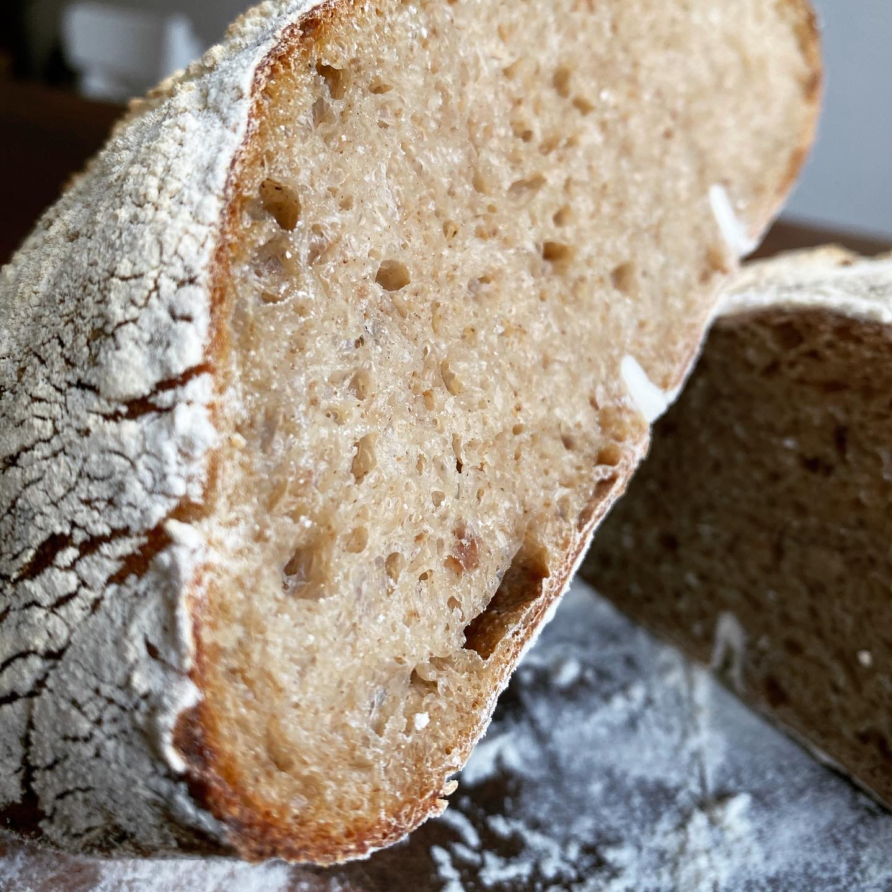

# Weizensauerteigbrot mit Altbrot

> 100g Altbrot als Quellstück auf 900g Gesamtmasse.

`100g` Altbrot (grob gehackt) mit `200g` kochendem Wasser quellen gelassen.

Nach dem runterkühlen auf Raumtemperatur kamen `100g` Sauerteig und `300g` Weizenvorteig dazu.

Kurz vermengt und mit `200g` Weizenmehl und noch `~50g` Wasser zu einem schönen Teig vermengt. 

`10g` Salz im Kneten dazu und das ganze über **3 Stunden** **4** mal gefaltet und noch mal **90 Minuten** im Gärkorb gehen gelassen bevor das der Teig **14 Stunden** in den Kühlschrank wandert.

Am Morgen bei **250 Grad** auf Dampf nach **5 Minuten** auf **230 Grad** ca. **30 Minuten** backen.
